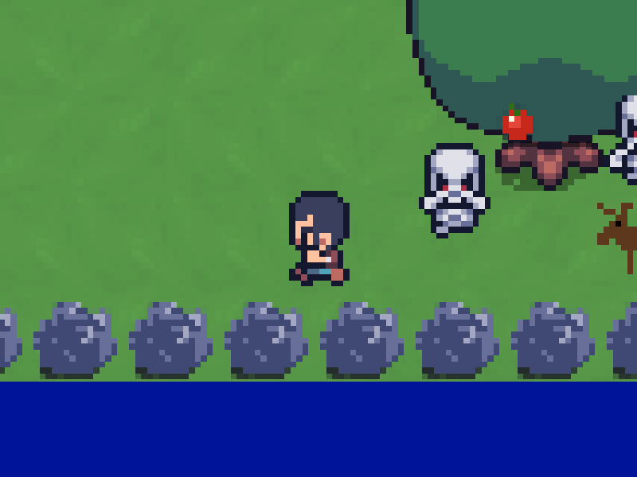
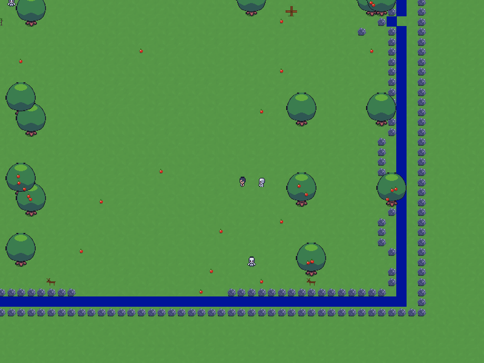

# piSTAR Landia

## Overview
A 2d game framework designed to provide playground for AI (Reinforcement Learning) agents. Humans are also welcome. 

**Version: 0.0.1-dev**: Early release not ready for general use. Only tested on Ubuntu and Windows 10.

## Screen Shots

<br/>
<br/>


<br/>
<br/>

## Features
- Multi Agent Support
- Openai gym interface for Single Agent Play
- Network Play support (Early Development)
- Crafting Support
- Support for concurrent modes (eg: Tag + Survival)
- Written in Python and requires only a few dependencies.
- Highly configurable and hackable. Easily add new game modes, objects or maps.
- Included Game Modes:
    - Survival (collect food or die, avoid monsters)
    - Tag
    - Infection Tag
- Good Performance and low memory footprint with room for improvement.

### Planned Features
- Game Modes
    - Survival with Crafting/Hunting
    - Random Mazes/Terrian
    - Obstatcle courses which include solving multiple tasks
    - Block moving puzzles
    - Physics puzzles
    - Crafting tasks
    - Racing 
    - Soccer
    - Boardgames - checkers, chess
- Loading of external configuration and game code at load/runtime
- 2d physics support
- Observation types beyond RGB
- 1st person perspective view
- Admin UI for dynamic world changes
- World state saving
- Support for concurrent RL agent and human players
- Better/faster network play
- Async agent play i.e. environment doesn't block when waiting for action form agent
- Better HUD
- Ingame menus

## Known Issues
- No argument to set the game seed
- Network play does not scale well.
- Incomplete documentation and testing
- Network play uses more bandwidth than needed.
- No runtime full game reset

## Performance
There are many factors that can impact FPS including: map size, number of game objects, resolution, number of agents, and game logic.

Test below are for 1 agent @ 84x84 on an i7 Laptop
 - small maps 2500+ FPS
 - large maps 800+ FPS

Full resolution human players can expect several hundred FPSaaa## Requirements
- python 3.7 or newer installed
- pygame (rendering)
- l4z (network compression)
- pyinstrument (performance profiling)
- gym (usage of OpenAI Gym spaces and env interface)

## Installation

1. Make sure python 3.7 or newer is installed
1. Download Repo:  ```git clone https://github.com/pistarlab/landia```
1. enter repo directory: ```cd landia```
1. (Optional) if using Anaconda, create conda environment: ```conda create -n landia```
1. Install requirements via pip: ```pip install -e .```


## Usage

### Local Game only (Human play)

```bash
landia
```

### Run Server and Local Client (Human play)

```bash
landia --enable_server --enable_client
```

### Connect to remote host
```bash
landia --enable_client --remote_client --hostname=SERVER_HOSTNAME 
```
### Run Random Agent Test
```bash
landia_test_env --agent_count=2 --max_steps=800000
```

***NOTE: For manual execution from repository you can use the following command***
```bash
PYTHONPATH=${PYTHONPATH}:./  python landia/runner.py
```

## RL Development

###  Using the Reinforcement learning Env interfaces

MultiAgent and Gym RL interfaces are here:
[env.py]( landia/env.py)

TODO: More documentation

## Acknowledgments

- My wife and kids for their inspiration and help testing
- Vryell's Tiny Adventure Pack. Currently used for most of the game art
    - See: https://vryell.itch.io/tiny-adventure-pack

