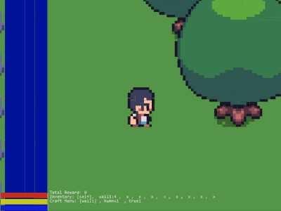

# piSTAR Landia

## Overview
A Hackable 2d game framework designed to provide a simple playground for AI (Reinforcement Learning) agents. Humans are also welcome.

**Version: 0.0.1-dev**: Early release so likely has bugs. Tested on Ubuntu and Windows 10.

## Screen Shots

Infection Tag



<br/>
<br/>

Capture the flag


<br/>

## Features
- Multi-agent support
- Openai gym interface for pingle agent play
- Network play support (early development)
- Support for concurrent  game modes (eg: Tag + Survival)
- Written in Python and requires only a few dependencies.
- Highly configurable and hackable. Easily add new game modes, objects or maps.
- Admin View for Multi-Agent matches
- Game Modes included:
    - Capture the flag
    - Survival (collect food or die, avoid monsters)
    - Tag
    - Infection Tag
- Crafting System
- Reasonable performance and low memory footprint with plenty of room for future improvements.

## Known Issues
- Limited number of objects
- Network play is laggy and does not scale to more than a few remoe users.
- Incomplete documentation and testing
- Network play uses more bandwidth than needed.
- No runtime full game reset
- No perspective view

[Future Imporvements](PLANNED.md)

## Performance
There are many factors that can impact FPS including: map size, number of game objects, resolution, number of agents, and game logic.

Test below are for 1 agent @ 84x84 on an i7 Laptop
 - small maps 2500+ FPS
 - large maps 800+ FPS

Full resolution human players can expect several hundred FPS
## Requirements
- python 3.7 or newer installed
- pygame (rendering)
- l4z (network compression)
- pyinstrument (performance profiling)
- gym (usage of OpenAI Gym spaces and env interface)

## Installation

### Standard (includes package only)
1. Make sure python 3.7 or newer is installed
1. ```pip install https://github.com/pistarlab/landia/archive/refs/heads/main.zip#egg=landia```

### Developer (includes code base)
1. Make sure python 3.7 or newer is installed
1. Download Repo:  ```git clone https://github.com/pistarlab/landia```
1. enter repo directory: ```cd landia```
1. (Optional) if using Anaconda, create conda environment: ```conda create -n landia```
1. Install requirements via pip: ```pip install -e .```

## Usage

### Local Game only (Human play)

```bash
landia
```

### Run Server and Local Client (Human play)

```bash
landia --enable_server --enable_client
```

### Connect to remote host
```bash
landia --enable_client --remote_client --hostname=SERVER_HOSTNAME 
```
### Run Random Agent Test
```bash
landia_test_env --agent_count=2 --max_steps=800000
```

### Controls

Standard Human player
```
~ : brings up console
wsda : movement: up/down/right/left

CONTROLS:
  console/show help   : ` or h (ESC to return to PLAY MODE
  camera mode         : m (ESC to return to PLAY MODE
  move                : w,s,d,a or UP,DOWN,LEFT,RIGHT
  push                : g
  grab                : e
  item  - menu select : z,c
  item  - use         : r
  craft - menu select : v,b
  craft - create      : q
  game step duration   : \"-\" (faster)/\"=\" (slower) 

CONSOLE COMMANDS:")
  reset             : Reset Game
  spawn <object_config_id> : Spawn Object
  save              : save game state
  load              : load game state

```

## Game Modes
Note: most the reward values were chosen arbitrarily. Please feel free to 


### Survival - [Default Config](landia/survival/config/base_config.json)

- Rules
    - Try to collect food and avoid dying of starvation or by being attacked
- Rewards
    - No reward signal

### Forager - [Config File](landia/survival/config/forager.json)

```
landia --config_filename=forager.json
```

- Rules
    - Try to collect food and avoid dying of starvation or by being attacked
- Rewards
    - -20 Starvation
    - +1 Found food

### Capture The Flag - [Config File](landia/survival/config/ctf.json)

```
landia --config_filename=ctf.json
```

- Rules
    - two teams, red and blue, try to catpure each other flags
    - capture the flag 3 times to win the round
    - round time limit to 1000 timesteps
    - attack opposing players to make them respawn/drop flag
- Rewards
    - +1 when getting opposing teams flag
    - +1 when retrieving agent's own flag
    - +10 when capturing the opposing teams flag

### Infection - [Config File](landia/survival/config/infection.json)

```
landia --config_filename=infection.json
```

- Rules
    - infected players have a blue tag and try to infect non infected players
- Rewards
    - -2  if infected at end of round
    - +10 if not infected by end of round
    - +1 when retrieving agent's own flag

## Configuration

After running Landia for the first time, a configuration and save directory will be created in your home folder. Example: HOME_DIR/landia.

Files within this folder can override any the default configuration:

- HOME_DIR/landia/assets/ will override the [landia/assets](landia/assets) folder
- HOME_DIR/landia/survival/default/base_config.json will override the [landia/survival/config/base_config.json](landia/survival/config/base_config.json)

### Using custom configurations
You can create your own configuration by specifying a configuration file. This configuration will override values within the [landia/survival/config/base_config.json](landia/survival/config/base_config.json)

Example: The following will look for ctf_fast_mode.json in the HOME/landia/survival/default/ folder.
```
landia --config_filename=ctf_fast_mode.json
```

### Maps

Maps are loaded from text files where each game tile/game object is represented by a **two digit code**. (eg r1=rock)  The code lookup index is defined in the [game config file](landia/survival/config/base_config.txt).

Example Predefined maps
* [Small map with wall](landia/survival/config/map_9x9vwall.txt)
* [Capture the flag 1](landia/survival/config/ctf_map_1.txt)
* [Capture the flag 2](landia/survival/config/ctf_map_2.txt)
* [Large Map](landia/survival/config/map_large_1.txt)

**Custom Maps** must be defined in the game config and will be loaded from the HOME_DIR/landia/ directory if found

### Save location
World saves will be stored in the HOME_DIR/landia/survival/default/saves folder


## Reinforcement Learning Environment Usage

MultiAgent and Gym RL interfaces are here:
[env.py]( landia/env.py)

* Observation Spaces
    - Box(0,255,shape=(42,42)). 42x42 RGB Images
    - The resolution is a paramter with 42x42 as the default
    - Currently only support for non-perspective 3rd person view (same as human)
    
* Action Space
    - Descrete(14)
    - UP, DOWN, RIGHT, LEFT, GRAB, DROP, USE, INV_MENU_NEXT, INV_MENU_PREV, CRAFT_MENU_NEXT, CRAFT_MENU_PREV, CRAFT, JUMP, PUSH


### Multi-Agent Interfcae with Random Agent
This multi agent interface is compatible on the RAY RLlib project's [multi_agent_env.py](https://github.com/ray-project/ray/blob/master/rllib/env/multi_agent_env.py) interface.

```python
from landia.env import LandiaEnv
agent_map = {str(i):{} for i in range(4)} #define 4 agents
env = LandiaEnv(agent_map=agent_map)
max_steps = 2000

dones = {"__all__":True}
episode_count = 0
actions = {}

for i in range(0,max_steps):
    if dones.get('__all__'):
        obs = env.reset()
        rewards, dones, infos = {}, {'__all__':False},{}
        episode_count+=1
    else:
        obs, rewards, dones, infos = env.step(actions)
    actions = {agent_id:env.action_spaces[agent_id].sample() for agent_id in obs.keys()}

```


### Gym Interface with Random Agent

Single agent [Gym](https://gym.openai.com/) environment interface

```python
from landia.env import LandiaEnvSingle

env = LandiaEnvSingle()
max_steps = 2000
done=True
action = None
for i in range(0,max_steps):
    if done:
        ob = env.reset()
        reward, done, info = None, False, {}
    else:
        ob, reward, done, info = env.step(action)
    action = env.action_space.sample()

```

## Citing

```
@misc{pistar_landia,
  author = {Kusenda, Kusenda},
  title = {A Hackable 2d Playground for Multi-Agent RL and Humans},
  year = {2021},
  publisher = {GitHub},
  journal = {GitHub repository},
  howpublished = {\url{https://github.com/pistarlab/landia}},
}
```

## Development

Landia's code is flexible but may be confusing at first. The code base evolved into it's current state and could really benefit from a refactoring with better naming. 
- The code base is divided into two parts two allow support for future content under the same framework. 

#### Overview
- Entrypoints [Human play](landia/runner.py), [RL Environment](landia/env.py) 
- Core Framework: in root of [landia](landia/)
    - This is the core framework code which multiple games could share. It handles things like the primary game loop, rendering, and client/server communication.
    - Main Context Object and (Human) Game loop are handled in [landia/game.py](landia/game.py).
- Assets: [landia/survival](landia/assets/)
    - Sprites, Sounds, and other shared media
- Game Content Types (currently only one type available)
    - Survival Game:
        - Root: [landia/survival](landia/survival/)
        - Configuration: [landia/survival/config](landia/survival/config)
        - Core content file: [survival_content](landia/surival/survival_content.py). This is where most of the game is wired together.
        - [State Controllers](landia/surival/survival_controllers.py) are the are used to control game state. This is were the rules for Forager, Infection, Tag and Capture the flag are defined        

## Acknowledgments

- My kids for their inspiration and help testing
- Vryell's Tiny Adventure Pack. Currently used for most of the game art
    - See: https://vryell.itch.io/tiny-adventure-pack

